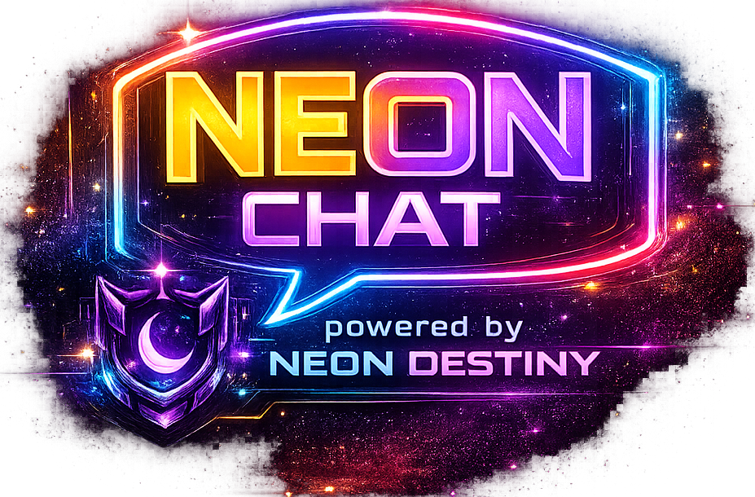

# NeonChat Updates

Official release notes for NeonChat, generated from the same update feed shown at [neonchat.co/updates](https://neonchat.co/updates).

> This file is generated. Update `src/components/UpdatesPage.jsx`, then run `npm run updates:sync`.

## Games Hub + RAWG-Powered Collections

**July 22, 2026** · Games Experience

- Launched the NeonChat Games Hub with RAWG-powered discovery, rich game artwork and metadata, personal collections, gameplay journals, and friends activity.
- Added My Games tracking for playing, completed, paused, backlog, wishlist, and dropped titles, including platform tags and detailed game views.
- Brought game activity into member profiles and Active Now areas with real game artwork instead of profile avatars.
- Added a compact Discord-style Game Collection row to profiles with stacked cover art, an overflow count, and direct routing into My Games.
- Made profile cards responsive in smaller app windows with a readable compact layout and contained scrolling.
- Moved Games Hub into the Friends navigation beside Discover and removed the oversized game shortcut from the server rail.
- Added reliable dedicated Games routes so collection links open My Games directly instead of falling back to Discover or invite handling.
- Kept RAWG credentials server-side and added normalized metadata, cached imports, graceful API errors, store links, screenshots, ratings, and official-site attribution.

## Nyx Return Signals + NeonChat Email Polish

**July 21, 2026** · Email Experience

- Introduced a respectful Nyx-led return email for members who have not signed in for at least 60 days, highlighting the latest NeonChat improvements without turning the message into a sales pitch.
- Added strict inactivity selection, marketing opt-out handling, signed unsubscribe links, daily campaign scheduling, and administration-only preview delivery for safer re-engagement outreach.
- Created Nyx’s Corner as a neon-cosmic email backdrop with a solid-color fallback for mail clients that do not display background images.
- Kept Nyx recognizable through the “Nyx · Guardian of the Neon Signal” signoff and the established authenticated NeonChat sender.
- Moved the reassurance that accounts, conversations, and communities remain waiting directly above See What’s New, giving the call to action warmer and more personal context.
- Added automated coverage for recipient eligibility, unsubscribe security, current product highlights, artwork inclusion, and call-to-action hierarchy.

## Live Service Health in NeonChat Support

**July 21, 2026** · Support Experience

- Turned View Service Status in the NeonChat Official support hub into a live health indicator backed by the public NeonChat status monitor.
- Added a green All Systems Operational state when every customer-facing monitor is healthy, with automatic refreshes every 60 seconds.
- Added a focused Voice Service Issues warning when affected checks are limited to voice and relay infrastructure.
- Added Core Service Issues whenever NeonChat API or NeonLogin Auth is affected, even if it is the only failing monitor.
- Added a red Service Outage state when three or more monitored services are affected, plus safe delayed/unavailable states when the status feed cannot be reached.
- Added affected-service details on hover while keeping the full status page one click away.
- Added a cached same-origin status endpoint so clients receive reliable health data without exposing cross-origin failures or overloading the external status server.

## Support Hub + DM Conversation Polish + Notification Controls

**July 21, 2026** · Messaging Experience Refresh

- Rebuilt the NeonChat Official #support experience as a native channel hub beneath the welcome area instead of leaving support actions attached to the message composer.
- Added clear Support Form, Report User, and Create Ticket paths with privacy guidance, service-status access, and direct routing into the staff-only admin ticket workflow.
- Corrected the official support welcome message ownership so it is posted by Nyx, opens Nyx’s system profile, and no longer appears as the generic NeonChat System identity.
- Added Copy Message ID to both the right-click menu and three-dot Manage Message menu for every message type, including official system and bot messages.
- Refreshed the DM friend list with presence indicators, activity context, last-message previews, and clearer timestamps so conversations feel active before they are opened.
- Expanded DM conversation headers with live presence and activity context while keeping the primary chat controls compact.
- Added a collapsible Conversation Hub with the friend profile, voice/video/profile controls, friendship status, shared-media count, loaded-message count, conversation search, and jump-to-result tools.
- Added friendship acceptance timestamps to newly accepted friendships and surfaced the real acceptance date in the Conversation Hub; older friendships now clearly show when a historical date is unavailable.
- Grouped consecutive DM messages from the same sender into readable conversation blocks, showing the avatar and sender header once per message burst instead of repeating them on every line.
- Improved DM hierarchy with one-line name and timestamp headers, stronger spacing between speakers, distinct subtle styling for sent and received messages, softer 16px bubbles, gradients, borders, and restrained depth.
- Added cleaner message-hover actions for quick copying and multi-message selection without cluttering the timeline when messages are idle.
- Added notification sounds for new server messages, DMs, mentions, friend requests, calls, and voice connection events, with a stronger cue reserved for direct mentions.
- Added Silent Mode as a dedicated Notifications setting separate from Streamer Mode, suppressing notification, ringtone, and connection audio while preserving visual toasts, desktop notifications, unread indicators, and normal presence behavior.
- Made enabling Silent Mode stop an active incoming-call ringtone immediately, so users can quiet NeonChat without changing their privacy or capture settings.

## Community Partner Redesign + Custom Sub-Domain Plan

**July 21, 2026** · Community Ecosystem Updates

- Created a public-facing /partners landing page detailing the exclusive benefits of the NeonChat Partner Program, including free sub-domain connection, extra emotes, complimentary Nexus Plus, vanity invites, and early access features.
- Redesigned the server settings Community Partner application into a fully structured, multi-field workflow (Language, Category, detected Members, Primary Platform, checkboxes, links, and guidelines agreements).
- Added a real-time Application Completeness indicator bar with reviewer confidence ratings (High, Moderate, Low) to guide applicants to provide all necessary details.
- Added status progress cards to settings (Not Submitted, Under Review, Needs More Info) to track partnership applications.
- Transformed the application panel into a live Partner Benefits Dashboard displaying active perks and partnership dates once approved.
- Renamed the Custom Domain Plan to the Custom Sub-Domain Plan in all configurations, matching feature lists, validation forms, and pages.
- Automated admin request approvals: approving a request in the admin dashboard now immediately toggles isPartnered = true and sets the partneredAt timestamp on the server, automatically unlocking all perks.
- Updated the admin dashboard pending requests view to render Category, Language, detected Members, reasons, invite links, description, and social links to reviewers.

## AuroraNexus Arrives + Native Automation Phase 4

**July 21, 2026** · AuroraNexus Phases 1–4

- Launched AuroraNexus as NeonChat’s native server automation, moderation, and community-management system, with its public home available at nexus.neonchat.co.
- Added an AuroraNexus workspace directly to Server Settings with eleven roadmap modules, monthly execution usage, server-scoped plans, module status, and native audit records.
- Added a server picker to the Nexus website so Manage a Server shows only communities the signed-in customer owns or administers, then opens that exact server’s Nexus settings.
- Moved module configuration into focused modals so opening an editor no longer pushes the full module grid down the page.
- Added independent Enable switches: configuration can be saved without activating a module, disabled Configure buttons are visibly subdued, and enabled modules use the full Nexus treatment.
- Made AuroraNexus appear as an online verified BOT in the server roster whenever at least one module is enabled, with immediate roster refresh and automatic removal when the final module is disabled.
- Added polished lifecycle messages using customer-facing module names, including clear enable/disable confirmation and a quiet inactive notice when every module is turned off.
- Delivered Welcome & Goodbye messages, automatic safe-role assignment, moderation cases and timed actions, automatic moderation rules, configurable logs, and usage-aware execution enforcement.
- Added Custom Commands with aliases, response variables, channel and role restrictions, per-member cooldowns, editing, deletion, server isolation, and Free/Plus/Pro command limits.
- Added configurable reaction-role panels, verification and rules settings, one-time scheduled messages, Plus repeating schedules, pause controls, safe role validation, and duplicate-execution protection.
- Started Phase 4 with functional Leveling: configurable XP ranges, anti-spam cooldowns, automatic levels, optional level-up announcements, announcement-channel selection, and server-isolated leaderboards.
- Added polished Nexus Plus ($7/month) and Nexus Pro ($10/month) comparison modals on both the public Nexus page and server settings, with direct Ko-fi checkout links and full entitlement details.
- Expanded the Nexus landing page with a dashboard preview, Custom Commands feature card, clearer native-product messaging, plan presentation, and an AuroraNexus-versus-traditional-bot comparison table.
- Unified Nexus controls around cyan-to-magenta styling, corrected default browser button leakage, improved plan pills, stabilized modal rendering, and removed GPU backdrop flicker from the server picker.
- Fixed the desktop three-dot Manage Message menu so left-click placement is measured from the actual trigger button, rendered in viewport coordinates, and flipped safely near screen edges instead of floating over the member roster.
- Kept the mobile long-press and compact action-drawer behavior separate from desktop placement by using the actual viewport layout rather than touch-capability detection.
- Added automated coverage for entitlement isolation, usage limits, command cooldowns, schedule deduplication, moderation state, and Phase 4 leveling behavior.
- Upgraded Monthly Activity from a bare quota into a live operations summary with execution percentage, real top-module counts, last-executed timestamps, and module-specific activity descriptions.
- Organized all eleven Nexus modules into Built-in Features, Protection, Engagement, and Utilities so the workspace remains understandable as AuroraNexus grows.
- Promoted Reaction Roles and Verification & Rules into native channel widgets that stay above chat instead of becoming bot messages that slowly disappear into channel history.
- Made Rules expandable with automatic bullet formatting, a compact content-sized card, friendlier review language, improved spacing, quieter AuroraNexus attribution, and a shield-led verification identity.
- Added a persistent verified completion state: after agreeing, members see a green Verified control, welcome confirmation, and their recorded verification date instead of watching the panel vanish.
- Created AuroraNexus as a first-party system profile with its official logo, verified BOT identity, System Active presence, rotating operational banners, and system-aware profile routing instead of a missing-user fallback.
- Added Shift-hover quick delete for desktop message users while preserving the three-dot menu and mobile long-press actions.
- Refreshed NeonChat transactional email into a Nyx-led signal system with branded security, identity, community, support, and AuroraNexus Operations templates.
- Granted NeonChat Official and the owner community complimentary unlimited Nexus Pro, while every server approved for the NeonChat Partner Program automatically receives complimentary Nexus Plus.

## Mobile Chat Layout + Discord-Style Message Actions

**July 19, 2026** · Android Mobile Refresh

- Fixed the oversized empty gap above the mobile composer by removing duplicated bottom-dock clearance while keeping messages safely above the input controls.
- Reduced the always-visible mobile message action button from 40px to 32px so it takes up less space on message cards.
- Changed message long-press behavior to open a touch-friendly action drawer with Edit, Reply, Select, Delete, and Report choices where available.
- Added Select to the message action drawer so users can enter multi-message selection directly from a held message.
- Reworked selection mode so its Delete Selected and Cancel controls replace the composer and remain visible above the bottom navigation.
- Moved the mobile action drawer to a document-level overlay so the chat scroller and fixed composer can no longer clip, constrain, or cover it.
- Disabled the desktop pointer-positioned context menu on touch devices, preventing Android long-press from opening a second off-screen menu based on finger position.
- Added a dimmed backdrop, safe-area-aware bottom-sheet layout, scrolling for larger text sizes, opening animation, vibration feedback, and reliable outside-tap dismissal.
- Rebuilt and synchronized the Android application bundle so the native app includes the corrected mobile chat interface.

## Meet Nyx + Streamer Privacy + Desktop Polish

**July 18, 2026** · Desktop 1.0.15 - 1.0.29

- Fixed the chat and DM message selector so clicking Select no longer immediately exits selection mode, empty selection mode stays active until Cancel/Escape, and plain clicks toggle messages on desktop as well as mobile.
- Polished the frameless desktop titlebar Minimize, Restore/Maximize, and Exit controls with crisp SVG icons, neon hover glow, press feedback, and a cleaner red close state.
- Officially named the violet NeonChat mascot Nyx: Guardian of Neon Destiny and Keeper of the Neon Signal, with his origin story on the About NeonChat page.
- Fixed Copy Link in the media viewer crashing desktop when clipboard access fell through to Electron unsupported browser prompt API.
- Created an exclusive violet crescent-shield Guardian crest for Nyx, separating his identity from the standard blue verified-bot check across profiles, messages, and member lists.
- Retuned the Guardian crest for profile-card scale with a larger 30px presentation, a simpler high-contrast crescent and signal eye, dedicated violet glow, explicit SVG dimensions, and cache-busted delivery.
- Gave Nyx a real exclusive Guardian server role, removed the incorrect Moderator assignment and permissions, and replaced the generic profile Role block with a lore-forward Calling card.
- Future-proofed Calling cards for explicitly assigned Neon Systems, Developer, Support, and Community Partner identities while keeping permission roles separate and leaving Nyx as the only active Calling by default.
- Added account-specific Callings for tehKluma as Builder of NeonChat / Founder of the Neon Network and WhovianWarrior as Builder of Neon Destiny / NeonChat Administrator, without changing their Owner or Admin permissions.
- Replaced the public MidniteBot identity with Nyx while preserving the same internal bot account, permissions, live-tracking automation, direct-message history, and message ownership.
- Added Nyx collectible profile facts plus a concise What is NeonChat section covering chat, voice, streamer safety, and communities.
- Added official selectable profile banners: Neon City, the original Nyx Realm skyline, and the original Midnight Streets cityscape, with Neon City remaining the polished fallback for new accounts.
- Replaced the blunt No bio set placeholder with friendlier empty-profile language.
- Turned Streamer Mode into a full privacy layer with dynamic vignette strength, protected title-bar state, an OBS Capture Safe banner, sensitive-popup protection, and the emergency Ctrl + Shift + H privacy shortcut.
- Added a live Privacy Inspector that separates protected information from intentionally visible public chat and media, with guidance for Maximum Privacy.
- Anchored the Privacy Inspector to its banner control, strengthened its opaque blurred surface, tightened its layout, and prevented chat underneath from ghosting through it.
- Stabilized the member-list privacy panel in its correct right-side layout across desktop and web.
- Improved temporary member-list reveal with a visible five-second countdown, identity reveal override, reliable timer reset, and a smooth fade back into protected mode.
- Added selectable Streamer Mode vignette strengths: Subtle (10%), Balanced (20%), Strong (35%), and Blackout (50%).
- Fixed desktop-only profile-card flicker while preserving stable browser behavior.
- Expanded profile polish around badges, rich presence, social identity, Spotify activity, banners, themes, and useful member context.
- Improved media viewing and messaging interactions, including smoother image presentation and more complete message actions.
- Polished voice behavior with stronger noise suppression, safer RNNoise processing, better reconnect handling, and clearer regional path latency.
- Branded the Windows assisted installer with NeonChat dark violet, cyan, and pink styling plus Nyx artwork and matching installer/uninstaller identity.
- Published desktop 1.0.15 through the automatic updater with a versioned installer, blockmap, latest-download alias, and verified public metadata.
- Continued the same Nyx release line through desktop 1.0.16-1.0.29, covering Nyx lore, the live bot identity migration, official profile banners, clipboard crash recovery, ecosystem titles, the exclusive Guardian crest, Guardian role, official Calling framework, polished window controls, and the message selector fix.
- Created matching TeamMidnite and Neon Signal Subscriber crests with Nyx-inspired owl, crescent, signal, violet, cyan, magenta, and gold details.
- Fixed the profile initialization-order crash introduced by account-specific Calling titles, so profile cards open normally again.
- Audited every remaining browser prompt fallback so unsupported prompt calls cannot crash the Electron renderer during copy, reporting, review, or account-management flows.
- Gave Nyx a real job on loading and error surfaces: app boot, Suspense fallbacks, full renderer crashes, section crashes, and desktop startup/failure pages now feature the Guardian instead of a plain spinner or empty stack dump.
- Replaced the boring loading bar with Nyx signal-surfing — crescent-board ride, orbiting packets, violet lightning bolts, and rotating lines like “Riding a crescent board through the void. Wumpus would never.”
- Error screens now open with Guardian intervention copy, glitch-frame Nyx holding the signal, retry actions, and the technical stack still available underneath for debugging.

## Automatic Desktop Updates + RNNoise Stability

**July 16, 2026**

- Released NeonChat desktop 1.0.8 with fully automatic Windows updates: the app checks shortly after startup and every 30 minutes, downloads new releases silently, and notifies you when an update is ready.
- Update prompts now offer Restart Now or Later. Choosing Restart Now installs immediately, while deferred updates install automatically the next time NeonChat closes normally.
- Fixed the missing packaged `electron-updater` dependency that caused the previous updater code to disable itself at runtime, so future desktop releases no longer require users to manually download each installer.
- Upgraded the Windows desktop runtime from Electron 28 / Node 18 to Electron 33 / Node 20 so the bundled RNNoise WebAssembly engine runs on its supported runtime.
- Fixed the Windows renderer access-violation crash (`0xC0000005`) that occurred immediately after RNNoise initialized during voice restoration, reconnects, or page reloads.
- Hardened RNNoise teardown so queued audio callbacks cannot process frames after the WASM denoise state has been destroyed.
- Added a compatibility safety gate for older Electron builds: desktop 1.0.6 and earlier automatically fall back to browser noise suppression instead of entering an RNNoise crash loop.
- Published versioned installers, differential-update blockmaps, and live `latest.yml` metadata for the desktop updater feed.
- Fixed the Settings button briefly opening and immediately closing on its first use after a deployment: stale lazy chunks now recover through a reload without losing the requested Settings screen, and modal content clicks can no longer bubble into the background close action.

## Voice Region Recovery + Real Path Ping

**July 16, 2026**

- Fixed switching voice server location (US West / US East / Auto) while already connected so the call no longer gets stuck showing Connected with dead audio and no recovery.
- Region changes now soft-restart the live voice session in place: leave + rebuild ICE peer connections against the new TURN region + rejoin, without tearing down the whole App voice session host.
- Removed the broken region-reconnect path that forced a full disconnect (`leaveVoice` → `onLeave` → `clearVoiceSessionState`), which cancelled the rejoin timer and could leave the UI stuck.
- Region soft-restart no longer sets the manual-disconnect latch, which previously blocked `joinVoice` forever after a location change on the same channel.
- Sidebar Voice Connected status stays visible during the short region rejoin window (Reconnecting… in the voice room) instead of flipping to fully disconnected and never coming back.
- Voice ping in the sidebar now prefers real media-path RTT from WebRTC stats (and a TURN-region path probe when you are alone in the channel), so US West should read lower for California users than US East instead of only reflecting app signaling latency.
- US West relays resolve to Los Angeles and US East to Virginia; the status strip also labels whether the sample is media path vs relay path.
- Fixed inflated East Coast ping (~230ms): the old probe counted full TLS handshake time, ICE listed TURNS/TCP before UDP, and explicit regions still offered both coasts so clients could lock onto a far relay.
- Explicit US East / US West now pin to that region’s TURN only, UDP is preferred first, and region probes use TCP connect timing so East from the West Coast should land closer to ~70–100ms network RTT instead of ~230ms TLS noise.
- Reduced intermittent garbled audio / noise blips: softened the RNNoise VAD gate (higher floor, slower attack/release, longer speech hold), ramped gain inside each frame to avoid zipper clicks, and stopped hard-zero underruns in the mic uplink queue.
- Automatic voice region now pins to US West only (no dual-coast ICE fallback) so Auto no longer flaps between West/East relays; East Coast users should choose US East explicitly.
- Increased the mic uplink ScriptProcessor buffer and queue cushion so occasional processing overruns are less likely to punch holes in the audio.

## Voice Call Noise Suppression Overhaul

**July 16, 2026**

- Fixed mic noise processing so RNNoise actually runs on voice and video call uplinks instead of only claiming to — the old path disabled browser noise suppression and fell back to a light high-pass filter, which let fans, keyboards, and room noise through.
- Added a real bundled RNNoise WebAssembly engine (`@shiguredo/rnnoise-wasm`) for neural noise reduction on the local microphone only, leaving remote playback audio untouched.
- Added a soft VAD gate after denoise so residual background noise is near-muted between words while speech stays open, with a short grace window so natural pauses do not chop the start or end of phrases.
- Raised the default high-pass filter to ~85 Hz to cut desk rumble and HVAC thump, and tuned the default call profile for stronger “clean call” behavior (VAD threshold, grace, soft-gate floor).
- Improved the failure path: if RNNoise cannot load, NeonChat now re-enables browser noise suppression and applies a lightweight energy gate instead of shipping a nearly raw mic.
- Preloads the RNNoise model on app start so the first voice join pays less of the WASM warm-up cost, and updated Voice Processing settings copy to label RNNoise AI Suppression as the recommended mode.
- Runtime tuning remains available via `localStorage["neonchat-voice-call-profile"]` and `window.__NEONCHAT_VOICE_CALL_PROFILE__` for users who want more aggressive silence or a softer gate.

## Desktop Startup Screen

**May 13, 2026**

- Added a branded NeonChat startup screen to the Windows desktop app so the EXE shows a polished loading view before the main app finishes loading.
- The startup view now uses the NeonChat icon asset with glowing neon treatment, centered `NeonChat` text, and a subtle loading animation.
- Rebuilt the Windows installer and updated `NeonChat-latest-x64.exe` so new installs include the startup screen immediately.

## Twitch Emote Recovery + Desktop Load Fix

**May 13, 2026**

- Fixed Twitch global and channel emote loading after stale configured Twitch tokens caused emotes to fall back to plain text in chat.
- Updated Twitch emote token handling so invalid user-scoped emote authorizations are cleared instead of being treated as connected while only returning a partial catalog.
- Added a server-side Twitch emote alias file for replaced emote codes, starting with `kluma0Finea` rendering through the current `kluma0Fyne` emote.
- Rebuilt the Windows desktop package with an Electron loader fix so normal `ERR_ABORTED (-3)` navigation handoffs no longer show the hard “NeonChat could not load” failure page.
- Updated the public Windows download so `NeonChat-latest-x64.exe` serves the rebuilt 1.0.6 installer with the desktop load fix included.

## Desktop Titlebar + Windows Installer Refresh

**May 10, 2026**

- Updated the NeonChat desktop app to use its own frameless titlebar with custom minimize, restore/maximize, and exit controls instead of stacking the native Windows controls with the app chrome.
- Added a main-process handshake so the custom titlebar only appears when Electron confirms the window is actually frameless, preventing double titlebars when an older framed host loads the current web UI.
- Rebuilt the Windows desktop package as NeonChat 1.0.6 so the frameless window changes are included in the actual installed app instead of only the web renderer.
- Updated the public Windows download and auto-update metadata so `NeonChat-latest-x64.exe` and `latest.yml` now point to the fixed 1.0.6 build.
- Happy Birthday to tehKluma, the one-person dev crew keeping NeonChat moving one fix, rebuild, and late-night sanity check at a time.

## Mobile Messaging Composer + Selection + Send Fixes

**April 12, 2026**

- Reworked the mobile DM and chat layout so the message list is the true scroll container, with bottom clearance reserved for the composer instead of letting messages slide under the input bar.
- Pinned the mobile composer above the bottom app dock with unified safe-area-aware spacing so the input row, jump-to-latest affordance, and picker surfaces all follow the same bottom offset rules.
- Added mobile long-press message selection for both server chat and DMs so touch users can enter selection mode without desktop keyboard modifiers.
- Updated mobile selection behavior so once selection mode is active, tapping messages toggles them in or out of the current selection instead of replacing the whole selection set.
- Moved mobile DM selection indicators fully inside the visible bubble row so the selected-state marker no longer sits clipped off-screen near the edge of the viewport.
- Hardened `Delete Selected` so the client now only removes the exact IDs that were selected at tap time and blocks any unexpected extra delete payload from being applied locally.
- Kept the dedicated send button in place and added an explicit mobile DM click-send path so tapping the send icon triggers `sendMessage()` directly instead of relying only on form-submit behavior.
- Backed up the repaired messaging and updates files to `backups/neonchat-mobile-messaging-composer-selection-send-fixes-20260412-070656.tar.gz` so this mobile messaging repair has a named restore point on disk.

## Sidebar Category Header Drag-Target Fix

**March 23, 2026**

- Fixed the server sidebar so uncategorized `Text Channels` and `Voice Channels` sections no longer render with the wrong brighter drag-target header styling while real categories use the normal header look.
- Tracked the mismatch down to sidebar section state instead of theme colors: fallback sections were being treated like active drag targets because their empty category id matched the empty drag-over state.
- Updated the sidebar section renderer so drag-target and dragging classes only apply when a real category id exists, which makes categorized and uncategorized sections follow the same header styling rules again.
- Backed up the repaired sidebar and updates files to `backups/neonchat-sidebar-category-header-fix-20260323-164816.tar.gz` so this working state can be restored quickly if needed.

## Channel Drag-and-Drop + Category Permission Fixes

**March 22, 2026**

- Added sidebar drag-and-drop for regular channels, so server owners, admins, moderators on the main server, and anyone with that server’s channel-management power can move channels around directly instead of relying on only edit screens or arrow buttons.
- Dragging a channel now supports Discord-style organization flows: you can drop a channel before another channel to reorder it, drop it onto a category header to move it into that category, or drop it back onto the root channel list to make it uncategorized again.
- Updated the sidebar structure so once a server has real categories doing the grouping, the fake default `Text Channels` and `Voice Channels` headers stop taking over the layout and uncategorized channels sit cleanly at the root.
- Fixed system-channel behavior so protected channels like `live-now` can still be moved between categories even though their names and topics remain locked from normal edits.
- Removed the old name-collision rules that were blocking saves just because a category and channel or a text and voice channel shared the same name, so channel/category naming now behaves much closer to Discord.
- Created a rollback backup for this channel/category work at `backups/neonchat-channel-drag-category-fixes-20260323-015134.tar.gz` with SHA-256 `335d8a45b161f91927368e56d55837235161b1a7637b17a9866542e2e6cdba73`.

## Channel Categories: Sidebar Create Flow + Broadcasting Restore

**March 22, 2026**

- Reworked channel creation in the left sidebar around compact `+` actions on channel and category headers instead of a large creation card taking over the sidebar.
- Added right-click actions on channel sections and categories so server owners/admins can quickly open `Add Text Channel`, `Add Voice Channel`, and `Add Category` directly from the sidebar.
- Added sidebar drag-and-drop reordering for categories, so admins can grab a category header and move it around instead of having to rely on separate settings controls.
- Restored a real `Broadcasting` category on the main NeonChat server and automatically grouped the broadcast-related channels under it when the backend normalizes server channels.
- Kept the existing backend channel move rules in place underneath the new sidebar UI, so category reordering still uses the same permission checks and audit trail as the settings screen.

## Mobile Voice Recovery + Volume Crash Fix + Faster Spotify Now Playing

**March 22, 2026**

- Fixed mobile voice join reliability by adding a safer microphone-capture fallback ladder, so phones and tablets can retry with lighter audio constraints instead of failing on stricter device settings.
- Added a real `Join Voice` action for disconnected voice rooms so microphone permission can be triggered from an explicit tap instead of depending entirely on background auto-join behavior.
- Fixed the mobile voice-room recovery flow so failed microphone permission prompts no longer leave the voice panel trapping the rest of the app behind it.
- Added a dedicated close button to the voice-room header so users can collapse the mobile voice room without having to fully disconnect first.
- Fixed a frontend crash when adjusting per-user voice volume by clamping remote audio element volume to the browser-safe `0..1` range instead of allowing boosted values that throw `HTMLMediaElement.volume` errors.
- Improved the account `Listening now` Spotify notice so current-track updates reach the signed-in user state correctly and refresh much closer to the actual song change instead of hanging on stale metadata.
- Updated the settings shell to follow the active theme more visibly, so the sidebar, cards, accents, and surrounding chrome now preview the selected app-wide color mood instead of staying locked to the default neon styling.
- Backed up the repaired voice, Spotify, styles, app, server, and updates files to `backups/neonchat-mobile-voice-spotify-fixes-20260322-234812.tar.gz` so this working state has a named restore point on disk.

## iPad Voice Roster + Tablet Web Nudge Fix

**March 18, 2026**

- Fixed the server voice-room layout on iPad and other tablet-sized browsers so the right-side member roster stays visible during voice chat instead of being hidden like a phone drawer.
- Added a dedicated tablet breakpoint for the members sidebar so tablet web keeps a slimmer live roster visible without changing the desktop voice layout.
- Updated the voice-room content shell to reserve matching space for the tablet roster, which prevents the main voice view from stretching under a hidden sidebar state.
- Stopped the `Download our app` web prompt from showing on tablet-sized layouts so iPad browsers no longer get a phone-style install nudge over the interface.

## Mobile Server Settings Layout Fix

**March 18, 2026**

- Reworked the server settings screen on phones so it no longer tries to cram the full desktop two-column layout into a mobile viewport.
- Added a dedicated mobile server-settings header with the current server identity and status badges so the screen still feels anchored after the desktop sidebar collapses away.
- Replaced the oversized left-side settings rail on small screens with a compact horizontally scrollable section picker so switching between Profile, Overview, Channels, Roles, and moderation tabs is much easier on touch devices.
- Tightened mobile spacing, card padding, close-button placement, and stacked form rows so server settings controls feel like a proper phone screen instead of a shrunk desktop modal.
- Backed up the current project state to `backups/neonchat-mobile-server-settings-fix-20260319-005759.tar.gz` so this mobile settings repair has a named restore point on disk.

## Roles Master-Detail Rebuild + Assignment Crash Fix

**March 18, 2026**

- Rebuilt the Roles settings screen from the ground up into a true master-detail editor with a compact role list on the left and a focused selected-role editor on the right instead of the old long stack of expanded role cards.
- Added dedicated editor sections for Display, Permissions, Members, and Danger Zone so role management is now organized around one selected role at a time instead of mixing edits across the whole page.
- Replaced the old inline permission checkbox clusters with grouped vertical toggle rows and calmer panel styling so the Roles editor feels more structured and easier to scan without copying Discord directly.
- Kept system-role protections intact so roles like Owner and Admin still respect lock states, edit restrictions, and delete guards while custom roles remain fully editable.
- Added a sticky Save/Reset action footer for role edits so identity, color, tag, and permission changes can be staged together instead of firing immediately across scattered controls.
- Fixed a role-assignment modal crash caused by recursive custom-role resolution in the shared role utility, which could overflow the call stack after assigning a non-standard custom role to a member.

## Channel Settings Shell Repair

**March 18, 2026**

- Fixed the dedicated channel settings path after the recent settings-shell refactor so opening channel settings no longer lands on a blank dark panel.
- Repaired the channel-editor visibility flow by stopping the embedded channel editor overlay from being faded out alongside the background settings content during channel-only mode.
- Fixed a second channel-only render bug where the main settings-content shell stayed hidden even after the channel editor loaded, which left the modal frame visible but empty.
- Retuned the server-settings wrapper/class wiring so the dedicated channel editor can load inside the embedded settings path without inheriting the wrong hide/show behavior from the base server settings content shell.

## Settings Shell Stabilization + Sidebar/Search Polish

**March 17, 2026**

- Refactored settings into one canonical modal flow so user settings, server settings, and channel settings no longer stack stale panels behind each other or reveal an old settings layer after close/reopen.
- Separated shared settings-shell framing from page-level sizing so embedded Server Settings no longer inherit the wrong user-settings grid, which fixes the squeezed center column, giant empty right-side void, clipped headers, and competing scroll containers.
- Removed conflicting duplicate settings-shell CSS and restored one authoritative layout path for the user settings modal instead of multiple `.settings-modal` rules fighting each other in the cascade.
- Repaired sidebar item theming after the shell cleanup by restoring explicit dark default, hover, focus, and selected states for settings nav items so they no longer fall back to bright browser-style button surfaces.
- Retuned the user settings layout with a tighter left rail, left-aligned main content, and a slightly narrower content column so the modal uses space more intentionally without rebreaking the separate server-settings shell.
- Improved account hero presentation by lowering the profile stack under the banner, fixing avatar overlap/clipping behavior, and adding a live Spotify now-playing notice when connected Spotify presence data is available on the user account.
- Upgraded Settings search so common user language now resolves to the right section even without exact tab names, including queries like `sound` for Voice & Video, `themes` for Appearance, `alerts` for Notifications, and `hotkeys` for Keybinds.

## Channel Permission Unification + Recruitment Embeds + Message Resurrection Fix

**March 17, 2026**

- Unified locked-channel visibility and access rules behind one canonical backend resolver so channel lists, channel joins, history loads, composer availability, and right-sidebar member filtering all now follow the same owner/admin-aware view decision.
- Added denial-path diagnostics for channel access so the backend now logs the user id, guild owner id, member roles, admin-bypass result, locked flag, final `canViewChannel` result, and the code path that triggered any remaining denial.
- Fixed a socket auth race where the client could try to join a channel before socket authentication completed, which could incorrectly trigger locked-channel denial behavior even when the final canonical view check should pass.
- Upgraded Team Midnite recruitment intake posts from plain text dumps to real Discord-style embeds using NeonChat’s native embed renderer, then re-pulled the recent applications so the recruitment channel reflects the improved layout.
- Added desktop runtime diagnostics for the Windows EXE and fixed the renderer initialization issue that could leave the packaged app on a blank screen after the member-list permission work.
- Fixed deleted channel messages reappearing by correcting a dual-storage cleanup bug so deletes now purge both the server-specific message store and the legacy compatibility store instead of leaving stale copies behind for reloads to resurrect.
- Backed up the current permission, recruitment, message-storage, Electron, and updates files so this repaired state has a named restore point on disk.

## Shared Messaging Core + Cross-Platform Chat Rebuild

**March 16, 2026**

- Rebuilt DMs and server chat around one shared canonical messaging core so thread identity, immutable message reconciliation, optimistic delivery, delete cleanup, and composer availability now follow the same rules instead of drifting across separate code paths.
- Unified channel and DM realtime flows so history loads, live socket messages, optimistic local messages, bulk deletes, and stale UI cleanup now reconcile by current canonical thread data with nonce-aware dedupe and immutable updates.
- Hardened composer and thread lifecycle behavior so deleting messages or switching conversations no longer leaves behind stale reply, edit, selection, pending-send, or disabled-composer state.
- Improved cross-platform behavior for browser, mobile web, Windows, and macOS shells by adding a shared messaging viewport layer with keyboard-safe composer spacing, touch-aware action visibility, and larger tap targets for common message controls.
- Removed another hover-only dependency in chat so touch users can reliably open message actions without needing desktop-style hover behavior.
- Backed up the current App, DM, chat, styles, updates, shared messaging core, and shared viewport files so this rebuilt messaging state can be restored quickly if needed.

## Memberships & Billing Stability + Chat Paste Support

**March 15, 2026**

- Fixed the Connections > Memberships & Billing section so Ko-fi status refreshes no longer bounce user state back through a repeated re-render/re-fetch loop that made the panel flicker and become hard to read.
- Improved Memberships & Billing error handling so browser-level network failures now show a steadier subscription-plans message instead of flashing raw `Failed to fetch` copy in the middle of the billing panel.
- Fixed host-aware API base resolution for first-party `*.neonchat.co` subdomains so pages that do not actually proxy `/api/*` keep talking to the primary NeonChat API host instead of failing on the current subdomain origin.
- Added operator-facing Ko-fi webhook diagnostics in Memberships & Billing so admins, moderators, and team members can see recent webhook failures such as invalid verification-token mismatches without digging through server data files.
- Added paste-to-upload support in community server chat so pasted clipboard images and GIFs now attach through the same preview and upload flow as the existing image picker.
- Backed up the current Memberships & Billing, routing, server chat paste, and updates files so this repaired state can be restored quickly if needed.

## Services Page Launch + /services Routing Fix

**March 15, 2026**

- Added a public `/services` page that explains the current NeonChat Professional Services subscriber perk: custom domain linking plus 50 extra custom server emote slots.
- Hooked the new services page into the public app route set so it loads as a first-class standalone page instead of falling through to invite-style path handling.
- Added visible `Services` links on the login screen and inside the custom-domain subscriber gate so people can read the plan details before subscribing.
- Fixed a routing bug where `/services` was being rewritten to `/?invite=services` by reserving that path in both the frontend router and backend bootstrap invite-slug logic.
- Backed up the current services-page and routing-fix files and refreshed the live backend process so this working state is preserved and active.

## Community Voice Disconnect Rejoin Fixes

**March 15, 2026**

- Fixed community voice disconnect actions so the in-room red hang-up button, including the full-screen mobile voice room view, and the sidebar `Voice Connected` disconnect button now fully leave the call instead of immediately rejoining it.
- Cleared the hidden voice session host state on manual leave so background voice UI no longer stays mounted with auto-join still armed for the same channel.
- Canceled stale in-flight join attempts and pending auth-based auto-join retries after an intentional leave so slower mobile voice setup cannot reattach the same room after the user already disconnected.
- Canceled any pending voice region reconnect timer during manual disconnect so a queued reconnect cannot revive the same community voice session right after leaving.
- Added a direct app-level hard disconnect path for the desktop/sidebar `Voice Connected` panel so its Disconnect button clears the connected channel state immediately instead of waiting on the hidden voice room host to finish cleanup.
- Backed up the current community voice disconnect fix files and notes so this working state can be restored quickly if needed.

## Android Server Drawer Overlay Fix

**March 15, 2026**

- Fixed the Android server discovery view so opening the community drawer no longer leaves the app blurred and dimmed with the server list hidden underneath.
- Moved the mobile overlay into the same app shell stacking context as the server and channel drawers so the overlay stays behind the drawer UI instead of covering it.
- Rebuilt the web bundle and synced the updated assets into the Capacitor Android project so the wrapper picks up the repaired mobile navigation layout.
- Backed up the current Android drawer fix files and notes so this working state can be restored quickly if needed.

## Subscriber Badge + Custom Emote Upload Upgrades

**March 14, 2026**

- Updated the Subscriber profile badge to use the new crown-style SVG badge art instead of the older plain star fallback.
- Unlocked multi-file custom emote uploads for servers with more than 50 custom emote slots so higher-capacity communities can add several emotes in one run.
- Added automatic server-based custom emote naming so uploads can derive codes and saved filenames from the server name plus the original file name, such as `WhovianWarrior's Server` producing `whovianFilename.png`.
- Hardened custom emote uploads on both the client and backend so blank-code uploads no longer fail when the uploader is supposed to auto-generate the emote name.

## Default Server Branding Refresh

**March 14, 2026**

- Added branded defaults for community servers that do not have custom art yet, so empty server cards no longer fall back to bare placeholders.
- Server icons now use seeded DiceBear `glass` artwork with more varied default color and rotation combinations on new server creation.
- Server banners now fall back to the Kevin Laminto night-walkway Unsplash image when a community has no banner set.
- Kept existing custom server icons and banners untouched so only missing or reset artwork uses the new default branding path.

## GIF Picker Stability + Twitch Subscriber Emote Cleanup

**March 14, 2026**

- Fixed the community chat GIF picker so clicking a category no longer causes the picker to collapse or disappear while browsing.
- Moved GIF picker outside-close handling onto a safer pointer-down path and hardened in-picker interactions so category clicks stay inside the picker instead of being mistaken for an outside click.
- Tightened Twitch subscriber emote filtering in both server chat and DMs so global Twitch emotes and smilies no longer leak into creator-specific subscriber sections like `TEHKLUMA @tehkluma`.
- Backed up the current working chat, DM, style, server, and updates files so this stable state can be restored quickly if needed.

## Chat Delete Flow + Composer Recovery Fix

**March 14, 2026**

- Fixed a chat bug where editing or deleting a message could leave the channel composer unusable until the app was refreshed.
- Reworked message delete confirmation to use an in-app modal instead of the browser confirm dialog so composer state stays inside React and no longer gets stranded after delete.
- Hardened post-delete composer cleanup by clearing stale message action UI, closing transient popovers, and explicitly restoring focus to the channel input after delete and edit transitions.

## Voice Room Layout + Multi-Socket Voice Session Fix

**March 14, 2026**

- Fixed voice session cleanup so leaving, refreshing, or dropping one tab/socket no longer disconnects the same user from voice if another active NeonChat socket is still in that room.
- Added backend voice socket membership tracking so participant removal now happens only after the final linked socket actually leaves the server voice room.
- Fixed the server voice-room layout so opening the room no longer auto-compacts the main content area in a way that pushed the member list out of place.
- Kept the members sidebar visible beside the active voice room with a dedicated spacer path so the layout stays stable while you are connected.

## Trusted TehKluma Live Bot + Developer Docs + Chat Timestamp Polish

**March 14, 2026**

- Moved TehKluma community live announcements onto NeonChat’s trusted server-side posting path so live cards are created by the backend instead of a weaker client-style send flow.
- Added live-card reconciliation for the TehKluma feed so one post is created per live creator and stale cards are deleted automatically when that creator drops offline.
- Updated live announcements to post through the existing verified `DontBlameLexi` bot account so message identity, permissions, and rendering stay aligned with native NeonChat bot behavior.
- Added full hover timestamps to chat message time labels so users can still see compact times in-channel while getting the full posted date and time on hover.
- Added a new developer guide plus bots-and-automation docs in the repo to explain NeonChat’s architecture, bot ownership rules, service layout, and safe automation patterns for future contributors.
- Expanded the Help Center `Developer Bots` section with known-good example patterns for REST create/delete bot workflows and server-trusted polling flows so bot authors have working samples to follow.

## TeamMidnite.tv/NeonLogin QR Approval Flow Tightening

**March 13, 2026**

- Updated the TeamMidnite.tv/NeonLogin QR login flow so QR sign-in no longer drops users into the NeonLogin dashboard during approval.
- Tightened the QR handoff to send users straight into the dedicated approve-or-deny login step for a cleaner mobile confirmation flow.
- Improved the QR login experience so the approval path feels direct and focused instead of routing through unrelated account dashboard screens.

## Legal Pages + Member List Bot Polish + Emote Popup Styling

**March 13, 2026**

- Added public `/terms` and `/privacy` pages so NeonChat now has dedicated Terms of Service and Privacy Policy routes.
- Fixed verified bot rendering in the members list so bot rows show their lower status line and verified badge instead of a stripped-down fallback row.
- Updated profile live-state fallback behavior so manual LIVE status no longer incorrectly renders Twitch-specific copy when there is no real Twitch activity card.
- Restored the fancy emote metadata popup styling with the intended neon card treatment, readable source/owner rows, and proper action button styling.

## Text Channel Send Reliability + Chat Hardening

**March 12, 2026**

- Hardened community text-channel sends against duplicate and triple-post behavior by enforcing nonce-based server dedupe on the channel message path.
- Added socket acknowledgement handling on backend channel sends so client retries resolve cleanly against the original accepted message instead of creating another post.
- Normalized channel send failures for auth, empty-message, slow-mode, verification, and locked-channel cases so the client gets one consistent denial path.
- Closed the last legacy client send route so every text-channel message now uses the same nonce-and-ack delivery flow instead of a weaker raw socket emit path.
- Reviewed live backend service health and recent logs after the patch to confirm the text send path is stable and not showing new channel-message errors.

## Rich Messages: Embeds, Mini Players, and Discord-Style Markdown

**March 12, 2026**

- Added Discord-style webhook embed rendering in chat and DMs, including title, description, author, fields, footer, thumbnail, and image blocks.
- Extended webhook parser compatibility to support JSON and Discord-style `payload_json` form payloads so embed posts render reliably from common webhook tools.
- Added mini-player unfurls for supported links in message text: Twitch channel/player links, Twitch clip links, Kick channel/player links, and YouTube watch/share links.
- Added safe iframe-literal handling: when users paste `<iframe src="...">` as text, NeonChat extracts supported `src` URLs for mini players without rendering raw HTML.
- Added code formatting for both channel chat and DMs: inline code, fenced code blocks with language labels, and copy buttons on code blocks.
- Added safer Discord/Twitch-like markdown support in message text (bold, italics, underline, strikethrough, spoilers) plus quote (`>`) and list (`-`, `*`, `+`, `1.`) line rendering.
- Normalized Discord-style tag artifacts in webhook text so raw `<@id>` wrappers no longer appear as garbage; known IDs can resolve to app-style `@username` when the user is known locally.

## Windows Taskbar Branding + DM Video Recovery Control

**March 11, 2026**

- Set the desktop app display identity explicitly to `NeonChat` (app name, AppUserModelID mapping, and Windows executable name) so taskbar/jump-list labeling no longer falls back to `Electron` in packaged builds.
- Added an in-call `Turn On Camera` recovery control in DM video calls that appears when a user is in video mode but no local video track is active, then retries camera attach and renegotiates the call.
- Improved DM video panel fallback states so users now get clear local/remote camera status placeholders instead of blank black panes when video tracks are missing.

## Channel Settings Routing + Webhook Copy + DM/Call Hardening

**March 11, 2026**

- Changed channel gear actions (text, voice, and context-menu Channel Settings) to open the dedicated channel editor directly instead of the generic Channels list.
- Fixed dedicated channel editor layering so the base Server Settings panel no longer bleeds through behind channel settings.
- Hardened webhook `Copy URL` with clipboard fallbacks so copying works reliably even when browser clipboard APIs are restricted.
- Fixed duplicate DM sends by adding socket ack responses on `send-dm` and nonce-based server dedupe to stop retry-created triple messages.
- Improved DM video-call stability with stricter offer/answer media-mode sync, transceiver negotiation hardening, and explicit camera-feed placeholders when local/remote video tracks are unavailable.

## Reply Preview Emote Rendering Fix

**March 11, 2026**

- Fixed server chat reply previews so emote tokens now render as inline emotes instead of plain text in the reply reference strip.
- Kept reply preview rendering non-interactive to preserve the one-click jump-to-message behavior on the entire reply block.

## Whovian Theme Fix

**March 10, 2026**

- Fixed the broken `Whovian` theme by adding the missing theme variables, preview styling, and Whovian-specific voice button colors.
- Fixed account theme sync so `Whovian` now saves, loads, and survives API/socket auth instead of being dropped by the backend.

## Notification Routing, Badge Sync, and EXE Input Focus Hardening

**March 9, 2026**

- Normalized desktop notification settings against real browser permission state so granted browser notifications are no longer silently treated as disabled by stale local preferences.
- Added browser-side mention fallback handling for `server-message-notification` preview text and a server-room `server-message-activity` fallback path to improve badge delivery across multiple active clients.
- Fixed main-server channel badge key normalization so browser unread and mention counters resolve against the same channel keys used by the live app state.
- Collapsed channel badge rendering to a single red counter path instead of split yellow/red pills while keeping mention-first count priority.
- Hardened channel and DM composer focus behavior in the portable Windows app so typing works reliably after switching views without extra clicking.

## Voice Sidebar Speaking Indicators + DM/Friends Session Persistence

**March 7, 2026**

- Added stronger left-sidebar voice activity indicators: per-user `TALKING` badge, animated speaking bars, and active channel-row lighting while users are speaking.
- Improved speaking event wiring so local voice activity also updates sidebar indicators reliably instead of only remote participants.
- Stabilized sidebar speaking behavior to prevent random mid-speech dropouts with improved release timing and event handling.
- Fixed community voice session persistence so switching to DMs/Friends no longer drops active voice connection.
- Kept voice session mounted in background layout outside server view, while preserving full room layout only when actively viewing the voice room.

## Runtime Ownership Cleanup + Profile Bio Sync Fixes

**March 7, 2026**

- Removed process-manager conflicts by disabling `pm2-vscode.service` and moving NeonChat runtime ownership to `neonchat.service` (systemd-only).
- Resolved port conflict/restart-loop issues on `:3010` caused by duplicate PM2/manual Node processes (`EADDRINUSE`) and validated stable service startup under systemd.
- Restored profile bio link styling so profile links render as fancy pills again instead of plain default browser links.
- Fixed Whovian profile source consistency by syncing linked account bio records and validating live API output from the active service process.

## Developer Bot Posting Route Fix + Help Center Developer Guide

**March 7, 2026**

- Restored REST bot posting by adding `POST /api/channels/:channelId/messages` so developer bot tokens can post directly to server channels again.
- Aligned bot REST message behavior with socket send rules, including server/channel access checks, message persistence, and realtime broadcast events.
- Updated the Help Center with a dedicated `Developer Bots` tab that explains how `developer.neonchat.co` works end-to-end.
- Added clear bot setup docs in Help Center for create/submit/invite/token flow, plus REST and socket posting examples for faster integration.

## Mobile Voice Layout + Global Voice Session Persistence

**March 7, 2026**

- Adjusted mobile voice layout spacing so the call controls and bottom navigation no longer block key voice room content and actions.
- Updated connected voice status placement on mobile so the `Voice Connected` panel sits lower, just above the bottom menu area.
- Kept active community voice sessions alive while switching to other servers, so users stay connected until they manually disconnect or join another voice channel.
- Enabled global voice quick actions across servers so `Settings` and `Disconnect` remain usable even when browsing outside the voice server.
- Added a small speaker indicator badge on the server icon currently hosting the active voice session.

## Developer Portal Auth + Routing Hotfixes

**March 7, 2026**

- Fixed Developer Portal login handoff to use the live NeonLogin route (`/auth/neonlogin`) with return-to support for `developer.neonchat.co`.
- Added a backward-compatible server alias for legacy links (`/auth/neonlogin/start`) so old cached/bookmarked URLs now redirect correctly instead of returning 404 JSON.
- Fixed `Back To App` on developer/admin hosts so it returns users to `https://neonchat.co/` instead of looping on the portal host.
- Confirmed production session cookies are scoped for cross-subdomain auth continuity (`Domain=.neonchat.co`, `SameSite=None`, `Secure`) and enabled developer-domain CORS credentials flow.
- Verified Developer Portal API session fetch path is live (`/api/developer/portal`) and the Help Center route (`/help-center`) is wired in the app router.

## QR Login Live + Admin Bot Separation + Invite and Channel Stability

**March 7, 2026**

- Shipped QR Code Login end-to-end: users can start login on NeonChat, approve from NeonLogin on mobile, and sign in instantly after approval.
- Added NeonChat QR bridge endpoints for start/status and integrated session creation through the existing NeonLogin auth mapping path.
- Added NeonLogin QR API endpoints and approval page flow with DB-backed QR session records and one-time approval handling.
- Split Admin user management into human accounts and bot accounts, including separate bot visibility and bot-focused account details.
- Expanded the Community server watchlist view so staff can see all tracked servers instead of a shortened list.
- Fixed channel switch race conditions that could load the previous channel message list after rapid switching.
- Stabilized MidniteBot live posting with poll overlap guards and live-key dedupe to prevent repeat posts in `#live-now`.
- Added in-app invite unfurl cards for `neonchat.co/?invite=...` links so invites render with rich server preview UI in chat.
- Added crawler-targeted invite metadata rendering for social embeds so invite links can generate cleaner external preview cards.

## Emote Source Popups + Twitch Jump Links

**March 5, 2026**

- Added clickable inline emotes in chat: clicking an emote now opens a source details popup instead of leaving users guessing where it came from.
- Emote popups now show source metadata (Twitch global/sub, BTTV, FFZ, server custom, and owner/server details when available).
- Added direct `Open Twitch` action inside the emote popup when owner login data exists, so users can jump straight to the emote creator channel.
- Polished emote interaction styling with hover affordances and a dedicated details card to keep metadata readable without cluttering message text.

## Developer Bot Platform: Self-Serve Flow + Presence + Cleanup

**March 5, 2026**

- Launched a full self-serve Developer Portal flow for bots with create, edit, token reset, verification submission, and server invite actions.
- Added one-click `Quick Setup` for bots: submit for checkmark (when docs are present), invite to selected server, and copy starter connection code.
- Enforced checkmark requirements so bots must include valid Privacy Policy and Terms links before acceptance and invite eligibility.
- Added bot invite authorization checks so only users with server management permission can add a bot.
- Enabled bot-token auth for REST + socket bot operations and added an external REST message create endpoint for bot posting.
- Added REST message delete endpoint for bot self-cleaning workflows and verified create/delete behavior end-to-end.
- Added `Verified Bots` grouping in Personnel with bot badges and message-level verified bot marker in chat headers.
- Fixed personnel identity merge edge cases so linked human accounts collapse correctly while bot identities stay distinct.
- Fixed bot visibility scoping so bots only appear in servers they are actual members of (including neonchat-main relaxed roster exclusions).
- Added Developer Portal bot connection status pill (`Connected` / `Not Connected`) for instant run-state validation.
- Fixed channel selection race where loading channels could snap users back to the previous text channel after switching.

## Send Reliability Hotfix (DM + Channel)

**March 5, 2026**

- Added Socket.IO send acknowledgements with retry handling for channel messages and DMs so delivery state is confirmed instead of assuming success.
- Added nonce-based dedupe and in-flight retry collapse on the server for DMs so timeout retries no longer create duplicate messages.
- Removed duplicate DM delivery paths and added client-side ID dedupe as a safeguard against double-rendering.
- Fixed a DM composer lock state that could block typing and added single-flight send guarding so one action cannot trigger multiple parallel sends.
- Reduced the server member presence fallback poll interval from 4s to 20s now that socket push updates are the primary source.
- Fixed restart recovery path by restoring PM2 process persistence (`pm2 save`) and system startup wiring so NeonChat is automatically resurrected after host reboot.
- Stabilized PM2 boot handoff under systemd (`pm2-vscode`) to prevent empty process-list starts after restart.
- Updated MidniteBot live presence payload to publish verified bot flags (`is_bot`, `botVerified`, online status) so it appears online like other verified bot accounts.

## Admin Tickets, Voice Routing, Device Tests, and Theme Expansion

**March 2, 2026**

- Reworked the admin dashboard into clearer tabs for overview, server management, user management, and moderation so staff workflows no longer stack into one long page.
- Added a real admin-side support inbox with ticket open, close, reopen, and threaded two-way replies, while keeping email notifications active for new tickets, replies, reopen events, and closures.
- Added Discord webhook alerts for support tickets, reports, and server request actions so staff can watch important moderation and support events outside the app.
- Added a Help Center page plus direct Help shortcuts in Settings so users can learn how NeonChat works without relying on Discord habits.
- Added self-service account deletion, fixed deleted-account cleanup so removed users stay gone, and stopped deleted identities from being silently recreated by NeonLogin.
- Fixed connected-account labeling so real Twitch links and Twitch emote access are shown accurately without falsely claiming a Twitch account is linked.
- Improved voice routing with user-side region overrides, live voice-only reconnect when the active region changes, and a new alpha-only `Auto (Alpha / Cloudflare)` relay test mode.
- Upgraded Settings device tests so microphone checks now support live loopback playback and camera checks now attach reliably with better fallback handling instead of black previews.
- Added a new `Whovian` theme inspired by TARDIS blues with warmer console-room accents.

## DM Hub Refresh + Curated Server Discovery

**March 1, 2026**

- Reworked the desktop DM experience into a three-zone layout with Direct Messages pinned left, a Friends Hub in the center, and an Active Now rail on the right.
- Added a dedicated `Hub` return control in active DM headers so open conversations can jump straight back to the Friends Hub view.
- Added contextual `+ Add Friend`, `Accept`, and `Pending` actions directly in the DM header when chatting with someone who is not already on your friends list.
- Added a dedicated `Discover` action inside the DM sidebar that opens a curated partnered/verified server browser, separate from the broader public server browser.
- Restored the main sidebar server popup to list all public/discoverable servers again, while keeping the DM-side discover flow focused only on partnered and verified communities.
- Fixed DM avatar fallback handling so broken profile images now swap cleanly to the default avatar instead of showing broken-image text in conversation lists and headers.
- Adjusted DM conversation preview alignment so preview text and links stay left-aligned consistently instead of appearing visually centered.
- Added a dismissible web download promo banner on the login screen for users who prefer the browser app but may want to try the Windows EXE or Android app.

## DM Notifications + Mobile Media + Message Load Polish

**February 28, 2026**

- Added reliable in-app DM toast notifications with the dedicated `DMSound.mp3` alert path, including browser audio unlock fallback when autoplay is blocked.
- Restored DM image attachments and added inline direct-image/GIF rendering so posted `.gif`, `.png`, `.jpg`, `.webp`, and similar links embed in chat instead of staying plain text.
- Added Giphy support in DMs with a mobile-friendly unified `Emoji / GIFs` media sheet and kept Twitch emotes available in the same mobile picker flow.
- Improved mobile channel loading by caching recent messages per channel and rejoining the active channel automatically when the app regains focus or returns from the background.
- Cleaned up DM conversation previews so long messages and long links now clamp to a short single-line snippet instead of stretching the sidebar or causing overflow.
- Reorganized Settings with grouped sections, renamed `Voice & Audio` to `Voice & Video`, and added editable keybind capture for desktop shortcut settings.

## Mobile App Rollout + DM Call + Downloads Refresh

**February 28, 2026**

- Shipped Android app wrapper updates for login return flow, microphone support, branding, and direct APK downloads.
- Reworked DM voice/video call handling so incoming calls surface across the app, ringing clears correctly, and desktop video layout is larger and cleaner.
- Added camera device selection in Voice & Audio so desktop users can pick the correct webcam before video calls.
- Restored the fancy /downloads page and brought Windows, macOS, and Android download links back onto the main downloads screen.
- Fixed duplicate Twitch subscriber emote entries caused by channel-scope and user-scope merges returning the same emote twice for the same owner.

## Twitch Subscription Emotes + Connections Flow

**February 27, 2026**

- Added user-scoped Twitch subscription emote loading for Community Server chat and DMs, including grouped subscriber sections in the picker.
- Fixed subscriber emote owner labeling so emotes group under the actual streamer/channel instead of collapsing under the signed-in user.
- Added a dedicated `Connections > Twitch Emotes` section with self-service connect/disconnect controls and share settings.
- Reduced Twitch emote authorization to the minimum `user:read:emotes` scope for the emote-only flow.
- Fixed the Twitch emote OAuth callback so the token binds to the correct NeonChat user record instead of landing on the wrong local account.
- Current user mode is `All subscriptions`; individual channel selection is planned but not live yet.

## Steam Presence + East Voice Region + Ping UI Polish

**February 26, 2026**

- Added Steam presence integration with user SteamID64 linking in Connections and live in-app game status updates.
- Added Steam profile sections in user cards with now-playing game visibility and removed the extra Steam App ID line from profile display.
- Added official Steam sign-in notice art in Connections to match Steam branding requirements.
- Enabled East Coast TURN host routing so US East is now an active voice region option alongside US West.
- Updated server ping badge typography to a clearer display font for easier reading.

## Spotify Presence Visibility Fixes

**February 26, 2026**

- Profile now hides the Spotify card completely when playback is paused or stopped.
- Removed the fallback not-playing Spotify text from profile view.
- Right sidebar now clears song status as soon as Spotify reports playback is not active.

## Live Fix Pack: Emotes, Spotify, Badges, Message Stability

**February 25, 2026**

- Fixed Twitch emote rendering for receivers so posted emotes render from message metadata even when viewers do not own those emotes.
- Reworked Spotify Connections: Save + Connect now validates credentials, added Link Spotify OAuth flow, and separated app-only connection from user-authorized playback access.
- Added Spotify callback support for /auth/spotify/callback and surfaced the callback URL in Settings so dashboard setup is explicit.
- Fixed channel message send behavior where messages could appear, disappear, and require refresh by removing forced rejoin-on-send and stabilizing optimistic message reconciliation.
- Restored badge image serving path and profile badge URL handling so Founder/VIP/Streamer/AlphaTester/MidniteBot PNG badges render correctly when assets are present.
- Expanded patch runbook coverage with these regressions and recovery steps for faster incident response.

## Voice UX + TURN Routing Update

**February 24, 2026**

- Removed the extra disconnect icon from the voice channel row while keeping the main Disconnect button in the connected voice panel.
- Updated Voice Server Settings to use the in-app popup flow from dev (with channel-level override, voice bitrate, and video quality controls).
- Kept live TURN routing on self-hosted infrastructure and skipped Cloudflare TURN for production.
- Added East Coast TURN/coturn support as secondary relay alongside West Coast TURN for better regional failover.

## User Copy Actions Added

**February 20, 2026**

- Added Copy Username and Copy User ID options in message context menus.
- Added right-click copy menu support in DM conversation list usernames.
- Added right-click copy menu support on DM header username.

## Admin Ticket Visibility + Channel Copy Fix

**February 20, 2026**

- Locked #admin-tickets visibility to staff-only at both API and client guard layers.
- Fixed Copy Channel ID action with robust clipboard fallback behavior.
- Improved context-copy reliability across browser clipboard restrictions.

## Support + Report Intake Expanded

**February 20, 2026**

- Added /support and /reportuser pages with direct submission forms.
- Routed support and user reports into #admin-tickets automatically.
- Integrated staff email notifications for new support/report intake events.

## Spotify Presence Sync Stabilized

**February 20, 2026**

- Fixed stale song titles in the member list for browser users.
- Realtime presence now pushes updated track data without needing a manual refresh.
- Resolved merge behavior that could let older local user data override live presence.

## Status + Mini Profile Menu Rework

**February 20, 2026**

- Restored quick status controls: Online, Idle, Busy.
- Added Busy timing support and cleaner status update flow.
- Updated the mini user popup with the requested compact profile behavior.

## Image Viewer + Voice Reliability

**February 20, 2026**

- Fixed image modal behavior that was hanging and blocking chat view.
- Improved voice join/leave handling and channel join UX behavior.
- Resolved stream-stop edge cases that left stale frames visible.
